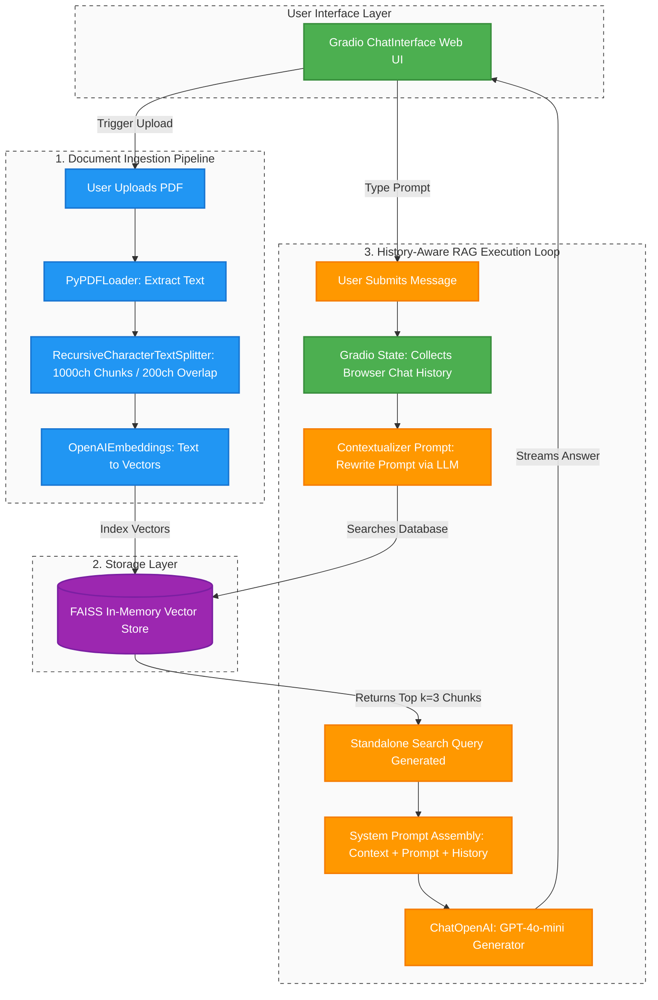

# 📄 AI PDF Chatbot with Conversational Memory

A lightweight, high-performance Retrieval-Augmented Generation (RAG) chatbot built with **Python**, **LangChain**, and **Gradio**. This application allows users to upload any PDF document, parses its contents into a semantic vector index using **FAISS**, and fields multi-turn, context-aware questions utilizing **OpenAI's GPT-4o-mini**.

---

## ✨ Features

- **Instant PDF Ingestion**: Extracts text contents and splits documents into optimized overlapping chunks.
- **Local Semantic Storage**: Utilizes Meta's open-source **FAISS** vector store database for millisecond-level similarity lookups.
- **Conversational Memory**: Rewrites ambiguous follow-up queries into descriptive standalone search parameters automatically.
- **Gradio Web Interface**: Dynamic dashboard with standalone upload widgets and standard, streaming-friendly chat logs.

---

## 🏗️ System Architecture

The project maps structural operations across three distinct tiers to ensure fast ingestion and smart generation pipelines:



---

## 📁 Project Directory Tree

```text
my_chatbot_project/
│
├── data/
│   └── Agentic_AI.pdf     # Default baseline document folder
│
├── src/
│   ├── __init__.py        # Makes 'src' folder importable
│   └── app.py             # Core LangChain RAG backend logic
│
├── main.py                # Gradio Frontend UI & app entry point
├── requirements.txt       # Project python dependencies list
└── README.md              # Project documentation
```

---

## 🚀 Quickstart Guide

### 1. Clone & Navigate to Repository
```bash
git clone https://github.com
cd your-repo-name
```

### 2. Set Up Virtual Environment & Packages
```bash
# Create environment
python3 -m venv .venv
source .venv/bin/activate

# Install dependencies
pip install -r requirements.txt
```

### 3. Configure Your Environment Keys
Provide your system environment profile with an authorized OpenAI platform API token:
```bash
export OPENAI_API_KEY="sk-proj-..."
```

### 4. Execute Application Launch
```bash
python main.py
```
Open your web browser and navigate directly to **`http://127.0.0.1:7860`** to begin interacting with your PDF documents.

---

## 🛠️ Requirements Stack
Make sure your `requirements.txt` file lists the following package baselines:
```text
gradio>=5.0.0
langchain>=0.3.0
langchain-community>=0.3.0
langchain-openai>=0.2.0
pypdf>=5.0.0
faiss-cpu>=1.8.0
tiktoken>=0.7.0
```
## ⚖️ License
Distributed under the **MIT License**. See `LICENSE` for more explicit distribution allowances.